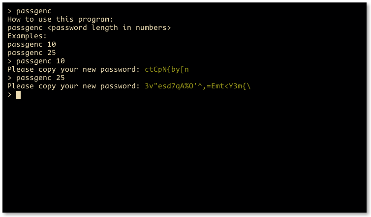

# passgen.c

this is a simple password generator written in C, it will generate a strong password for you to use

## how it works
        $ spg <options>
if no options were specified, spg will ask you for your password length, right now there are only two options

        -v, --vocab     	Set a vocabulary on which passwords are generated from.
        -s, --size      	Set the size of the generated password.

## this is how it looks

## depends on
- gcc
- make
- qmake

## installation
- clone the git repo

        $ git clone https://github.com/carmesim/passgen.c

- build the project

        $ qmake && make

- copy the binary to your path

        # cp src /usr/bin/spg

## uninstall
+ remove the src binary from your path
        # rm /usr/share/bin/spg
