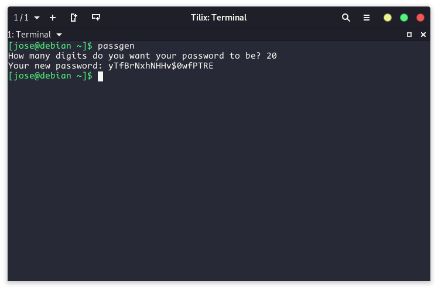

# Passgen.c
---
This is a simple password generator written in pure C it will generate a strong password for you to use

### How it works
        $ passgenc
The user inputs an integer to tell the program how many random numbers it is going to generate, the program generates those numbers and each number is a random element in a char array that is full of letters, numbers and symbols.
Then the output will be those random array items in single line, you can copy and paste the password anywhere you want

### This is how it looks

### Install
+ Clone the repository

        $ git clone https://github.com/Merazi/passgen.c

+ Move the "passgenc" file to a folder that is in your $PATH variable

        # cp passgenc /usr/share/bin

### Uninstall
+ Remove the passgen file from the folder you installed it before

        # rm /usr/share/bin/passgenc
